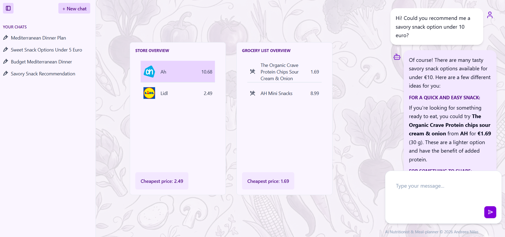

# Meal Planner

Meal Planner is an AI-powered meal prep and budgeting assistant. The goal of the project is to help users plan affordable meals, compare supermarket products, and receive practical nutrition-focused guidance.

The application combines a React frontend with a Python/FastAPI backend and a RAG workflow for supermarket product data.

<p align="center">
  
</p>

## Project Scope

This project focuses on building an AI meal prep budgeting agent that can:

- Understand user meal planning goals, dietary needs, and budget constraints.
- Search supermarket product data to find relevant grocery items.
- Recommend practical meals and grocery combinations based on available products.
- Support store-aware product lookup across supermarket datasets.
- Keep chat sessions so users can continue planning across conversations.
- Present meal planning, product, and grocery information in a clean web interface.

The current implementation is intended as an early full-stack prototype.

## Tech Stack

### Backend

- Python
- FastAPI

### Frontend

- TypeScript
- React
- Tailwind CSS
- Vite

### AI and Retrieval

- RAG workflow for supermarket product data.
- ChromaDB vector collections grouped by supermarket.

## Repository Structure

```text
.
├── app/                         # React + TypeScript frontend
│   ├── src/
│   │   ├── components/          # Chat, dashboard, grocery list, store list, and UI components
│   │   ├── scripts/             # API service, parsing, and utility helpers
│   │   ├── hooks/               # Frontend hooks
│   │   └── assets/              # Frontend image assets
│   ├── package.json
│   └── vite.config.ts
├── backend/                     # Python backend and AI agent code
│   ├── agent/                   # Nutritionist agent, summarizer, and tools
│   ├── api/                     # FastAPI route definitions
│   ├── data/                    # Supermarket data and ChromaDB data
│   ├── schemas/                 # Pydantic schemas
│   ├── scripts/                 # Product and vector database setup utilities
│   ├── main.py                  # FastAPI app entry point
│   └── requirements.txt
└── README.md
```

## Getting Started

### Prerequisites

- Python 3.10+
- Node.js and pnpm
- curl, or another tool for downloading files
- An OpenRouter/OpenAI-compatible API key

### Backend Setup

From the `backend` directory:

```bash
pip install -r requirements.txt
```

Create a `.env` file in `backend/` with:

```bash
OPENAI_API_KEY=your_api_key_here
```

Download the supermarket product data from [`supermarkt/checkjebon`](https://github.com/supermarkt/checkjebon) and add it at `backend/data/supermarkets.json`

```bash
curl -L https://raw.githubusercontent.com/supermarkt/checkjebon/main/data/supermarkets.json \
  -o data/supermarkets.json
```

Run the FastAPI server:

```bash
uvicorn main:app --reload
```

By default, the API is expected to run locally and allow requests from the Vite frontend at `http://localhost:5173`.

### Frontend Setup

From the `app` directory:

```bash
pnpm install
pnpm run dev
```

The frontend development server should start on:

```text
http://localhost:5173
```

## Supermarket Data and RAG Flow

The project uses supermarket data from [`supermarkt/checkjebon`](https://github.com/supermarkt/checkjebon) as source for product recommendations. Product records are indexed into ChromaDB collections, with separate collections for each supermarket. At query time, the agent can call product search tools. If the user mentions a known supermarket, the agent searches that store's collection. Otherwise, it searches across all supermarket collections and returns the most relevant products. This allows the assistant to produce real product recommendations.
